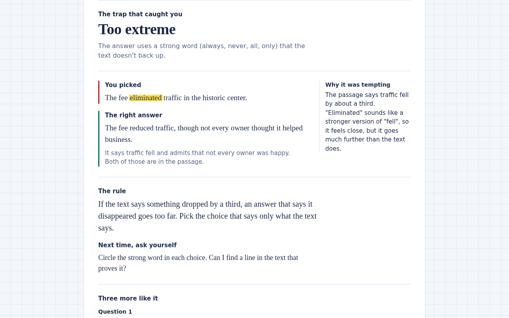
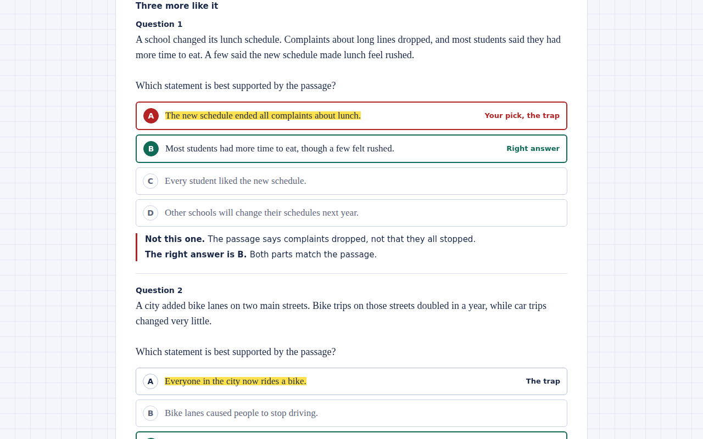
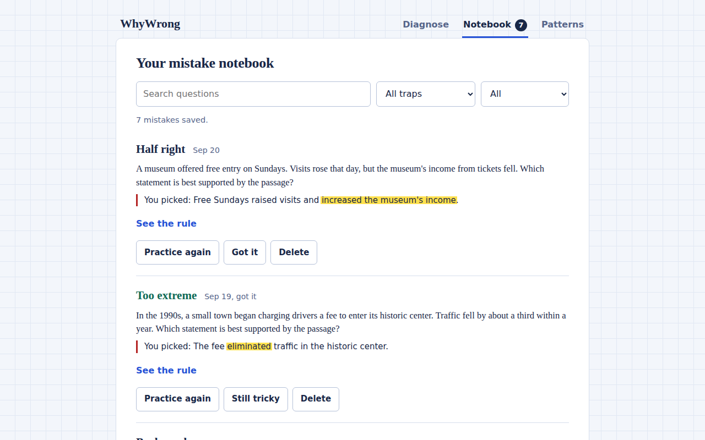
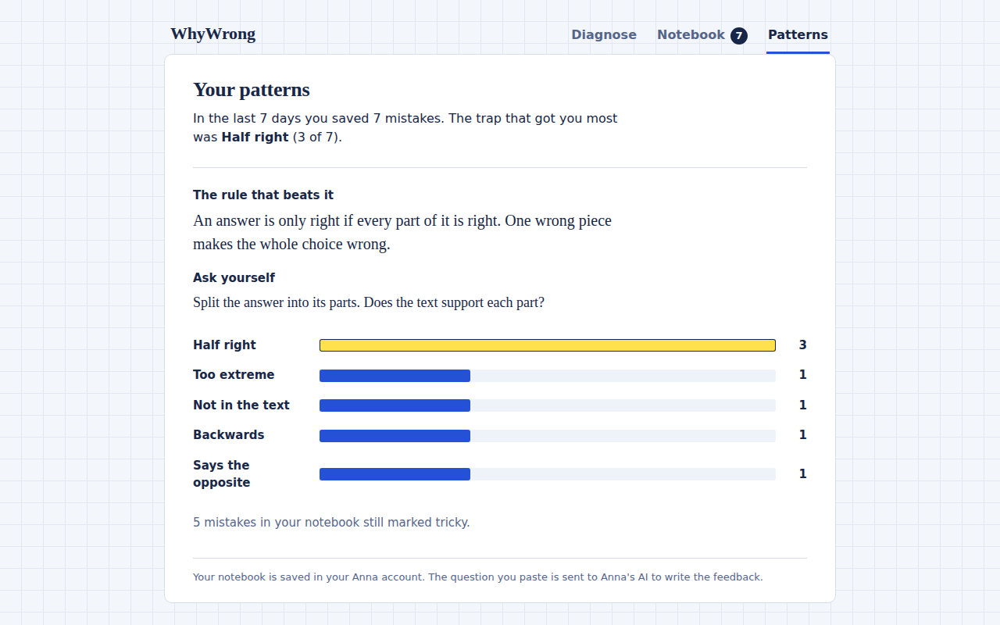
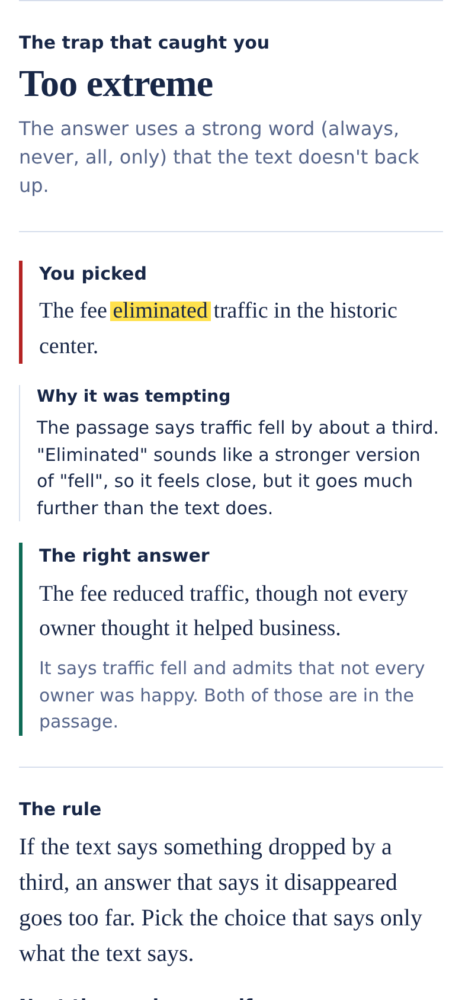
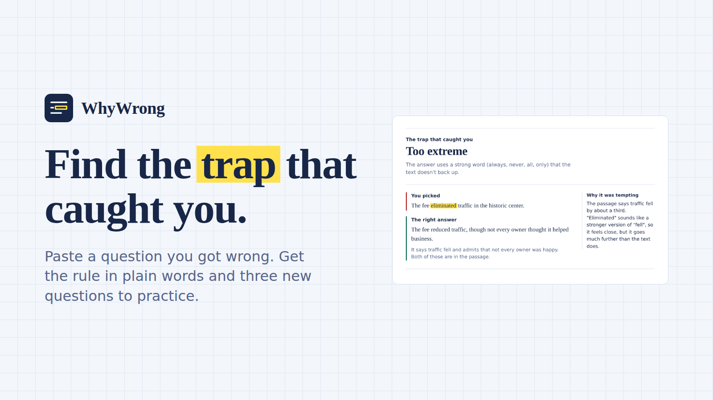

# WhyWrong

## What it is

WhyWrong is a study app that helps you understand why a multiple-choice
answer looked right when it wasn't. You paste the question, the answer
you picked, and the right answer. WhyWrong names the trap that caught
you, shows the exact words that fooled you, explains the rule in plain
language, and writes three new practice questions for the same trap.

It's built as an Anna app, so it runs inside Anna — no install, no
account beyond your Anna one, and your notebook is saved with Anna's
storage.

## How a student uses it

1. Open WhyWrong in Anna.
2. Paste the question you got wrong and the answer you picked. Add the
   right answer if you have it.
3. Read the diagnosis: which trap it was, the rule, and the words that
   tricked you.
4. Answer the three new practice questions WhyWrong writes for the
   same trap, with feedback on every choice.
5. Tap **Save to notebook**. Open **Patterns** to see which trap
   catches you most and the one rule that beats it.

## Screenshots







Cover image:



## Privacy

WhyWrong only sends the question you paste to Anna's AI to write the
feedback. Your notebook is stored in your Anna account. The app does
not collect personal details, run ads, or share data. Full details in
[PRIVACY.md](PRIVACY.md).

## For developers

A student pastes a multiple-choice question they got wrong and the answer they
picked. The app names the trap that caught them, explains the rule in plain
words, and writes three new practice questions for that trap. Mistakes go into a
private notebook, and a Patterns page shows which trap catches them most.

It is a UI-only Anna app: the screen runs in Anna's sandbox, the AI comes from
Anna's host AI, and the notebook is saved with Anna's storage. There is no
server, no outside API key, and no browser localStorage.

### What is here

```
app.json            store listing
manifest.json       permissions and UI settings (schema 2)
bundle/
  index.html        the screen
  style.css         the look (see DESIGN.md)
  core.js           trap list, AI prompt, strict checking of the AI's reply, notebook rules
  host.js           the ONLY file that talks to Anna (AI + storage)
  app.js            the screen logic
  samples.js        two original example questions
tests/
  core.test.mjs     43 tests for the logic and host adapter (with host.test.mjs)
  host.test.mjs
  e2e.mjs           18 browser tests with a strict CSP and a mock Anna
  mock-sdk.js       stand-in for Anna's SDK, tests only
DESIGN.md           design plan and what was avoided
```

### Run it

```
npm test                    # logic tests, no install needed (Node 22)
npm run test:e2e            # browser tests, needs Playwright + Chromium
anna-app validate --strict  # the real check. Run this first.
anna-app login --host https://anna.partners
anna-app dev                # opens the app with the REAL AI
```

### What I checked

- 43 logic tests and 18 browser tests pass. The browser tests run in real
  Chromium with the same strict content policy as `manifest.json`
  (scripts and styles from the bundle only), so inline code would fail.
- I broke the code on purpose in three places (reply checking, the retry, and
  "save even if the notebook can't be read"). The tests caught all three.
- Phone width (360px): no sideways scroll, every control 44px or taller.
- AI and student text is shown as text. A test feeds it HTML and script tags.
- If the notebook can't be read, saving is refused so nothing is overwritten.

### What I could NOT check (do these before you submit)

1. **The real Anna SDK.** I couldn't open Anna's SDK pages, so `host.js` assumes
   `anna.llm.complete(...)` and `anna.storage.get/set(...)`, imported from
   `/static/anna-apps/_sdk/latest/index.js`. If any of that is different, fix
   it in `host.js` only. Check against `docs/app-ui-sdk.md`,
   `docs/host-api-llm.md` and `docs/host-api-storage.md`.
2. **The real validator.** `manifest.json` is copied from the shape of a real
   published Anna app, and `app.json` from the beginner guide, but I couldn't
   run `anna-app validate --strict`. The `category` value in `app.json` is a
   guess. The Mobile Support page may also want a `form_factors` setting, which
   I did not add.
3. **The real AI.** The prompt and the strict checks are only tested with made-up
   replies. The first real runs may show the AI breaking a rule (for example,
   trap words that are not word for word in the picked answer). Try 5 to 10 real
   questions and tune the prompt in `core.js` if needed.
4. **The review.** There is no separate backend tool (executa). Anna's review
   asks for working backend logic, and I don't know if the host AI plus storage
   counts. Ask in the Anna developer forum before you submit.
5. **Real phones.** I tested a phone-sized window, not a phone.
